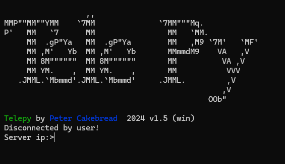

# Telepy
 Telepy is a terminal interface using TCP this project has been going on for almost 4 years. It features encrypted inputs, colour text, colour 2d arrays and more. The project features a complied exe client, a version for Linux, and server tools. If  you want a server, try going to 'server.fractaldev.co' where Telepy-connect is running. This is also a project running alongside this not the only use for this project you can use it for making your own BBS (Bulletin Board system), server monitoring, making an online version of the cli python project and more.
 

## Contents
<!-- TOC -->
* [Telepy](#telepy)
  * [Contents](#contents)
* [Client](#client)
  * [setup](#setup)
  * [Connecting to a server](#connecting-to-a-server)
  * [Settings](#settings)
* [Server](#server)
  * [Setup](#setup-1)
  * [Server Structure](#server-structure)
  * [Syntax](#syntax)
  * [Server Config](#server-config)
* [Contributing](#contributing)
  * [License](#license)
* [Planned updates](#planned-updates)
  * [v1.5.1](#v151)
    * [Automatic Updates](#automatic-updates)
    * [Bug fix](#bug-fix)
  * [v1.5.2](#v152)
    * [Cookie-like feature](#cookie-like-feature)
<!-- TOC -->

# Client
## setup
To set up the client to download the latest release this should be in the format of `v(version).zip`. This file contains two folders a server folder and a client folder this folder will contain a and exe, py and txt files. If you are on Windows you can just run the exe (Windows Defender will pop up click more info then run anyway. If you do not feel that you can trust the exe run the Client.py in the source code this is not the most optimized version though and may not be the correct version.) if you are on a Linux try connecting via the telnet client.

## Telnet Client
To use the telnet client all you need is a telnet client eg windows inbuilt client (Only works when explicitly enabled) or any other but it is recommended to use windows inbuilt client if you are on windows. When just connect to `telnet telnet.fractaldev.co`. It is recommended to use the windows client exe as this give the best experience and allows the saving of settings and in v1.9 automatic updates and session features. Also you server you are running has to have port forwarding to connect to has the telnet client doesn't run locally and on the the server. For testing your server local use the exe or host the telnet client your self.

## Connecting to a server

To connect the server just enter the ip or the domain by default servers run on port by default 1998. For the custom ports add `:` at the end of the IP/domain then the port eg `exsample.com:1234`. For the local host just enter `@` and `:` for the port eg `@:1234`.

## Settings

Settings can be easily changed at the prompt just enter `settings`.

### Weather location

The location used to get your weather using curl this information is not sent to the server.

### Default server

The server that can quickly be connected to when nothing is entered when asking for the ip.

### Switch Concent

This by-pases the input of asking if you would like to change the server. Eg if `false` you have to confirm if you would like to switch server. If `True` the client will switch server without the confirmation.

# Server

## Setup

To start a server go to the server folder of the release zip. There is a directory called `TelePy` and there should be a file called `tp.py` this is where the library is. To run the server simply run the `example.py` in the server directory.

## Server Structure

The structure of the `example.py` is recommended but also advised to modify/expand upon it depending on the project. The basic premise is that the client code will be excuted from `def client_side(client):` which parse the client object. To run the server you just have to run `tp.start(client_side)` with `client_side` the function that runs the client code. With this it will start the server which has builtin threading for clients, error handling, server information and ping handling all running under the port specified in config.txt.

## Config

To configure the information for the server on start up run

## Syntax

Here is the documentation of the syntax for telepy all examples have `client` as the client object and use `import Telepy as tp`.

### Log

This is a function built into telepy to make logging easier just use `tp.log('exsample.txt', 'Hello world!')` the log file or directory should be in the same directory as your server script.

### Setup

This function creates the socket that the server will run on based on the `server_config.txt` e.g. `tp.setup()` or `tp.setup_log('exsample.txt')` to log the output it gives.

### Print

This is the simplest function and just prints plain text `client.print('Hello world')`

### Cls

This function will clear the client terminal. `client.cls()`

### Input

This function will give a client a prompt and then return the string they enter. `user_input = client.input('Prompt :>')`

### Hidden_input

This function will give a client a prompt then it will hide the input when the user enters it in the client, then return the string they enter. `hidden_input = client.hidden_input('Prompt :>')`

### Password

This function will give a client a prompt then it will hide the input when the user enters it in the client, then return a hashed string of what they entered. `password = client.password('Enter Password input:>')`

### Client_version

This function is great for ensuring compatibility with the client the function will return a string which is the client version. `client_version = client.client_version()`

### Device

This work simular to `Client_version` but will return a string of the version of the client eg `win, web, lin, crt`. `device = client.device()`.`win` is a windows based client, `web` is a website based client, `lin` is a linux based client and `crt` is a linux based client but has a smaller screen size and wraps text differently.

### Weather

This function will display weather information by running `curl wttr.in` on the client it would also add on the client's location if they have specified it in their `config.txt`.

### Printc

This function will print colour text by specifying a foreground colour and a background colour in an array in that order like this `colour_data = ['green', 'black']` then `client.printc('Hello world', colour_data)`. Compatible colours are `'black', 'red', 'green', 'yellow', 'blue', 'magenta', 'cyan', 'light_red', 'light_green', 'light_yellow', 'light_blue', 'light_magenta', 'light_cyan', 'white'`.

### Print2d

This function will print a 2d array on the client end. `client.print2d(screen)` The array should be in the format of an array with each line a sub array.

### Print2dc

This function works in the same format but requires colour information. `client.print2dc(screen)` The array should contain a sub-array of each line and each character should display another subarray with colour information eg `[['@', 'red', 'black'], ['@', 'green', 'black'], ['@', 'blue', 'black']]` that would be one line of the array the colour is limited to the same set as `printc`.

### Closet

This is a function to close the client and give a message to display when disconnected. `client.closet("Disconnected from server.")` As a good rule make sure the disconnect message is helpful and informative.

### Closet_log

This is a function functions the same as `Closet` but logs the disconnect to a file. `client.closet('example.txt', "Disconnected from server.")`

## Server Config

This specifies the configuration for the server in the file called `server_config.txt`. To set the port use `port=1998` the default port is 1998. For the amount of clients the server listens to use `listen=120` the default is 120.

# Contributing

While this is a personal project, contributions are welcome! Please follow these steps to contribute:

1. Fork the repository.
2. Create a feature branch (`git checkout -b feature-branch`).
3. Commit your changes (`git commit -m 'Add some feature'`).
4. Push to the branch (`git push origin feature-branch`).
5. Open a pull request.

There will be a list of features at the bottom of the page for future updates that I am planning to work on feel free to give them a shot any help is appreciated.

## License

This project is licensed under the MIT License. See the [LICENSE](LICENSE) file for more details.

# Planned updates

## v1.5.1

### Automatic Updates

The client will automatically update and also be able to revert to older versions. not older than 1.3.1 due to older version security risks.

### Bug fix

Users can set on input for an indefinite amount of time. The causes server resources to be used while the client is not engaged. This will be fixed with a time-out period set in `server_config.txt`.

## v1.5.2

### Cookie-like feature

This may be implemented in different ways such as basic cookies but also a session-like feature featured in flask.

## Potential updates

- Assic art generator (text like the Tele py logo)
- Compiled linux disttro (client)
- Better cli for client eg `telepy server.fractaldev.co` instead of running the client then entering it.
- Api service to check server status.

